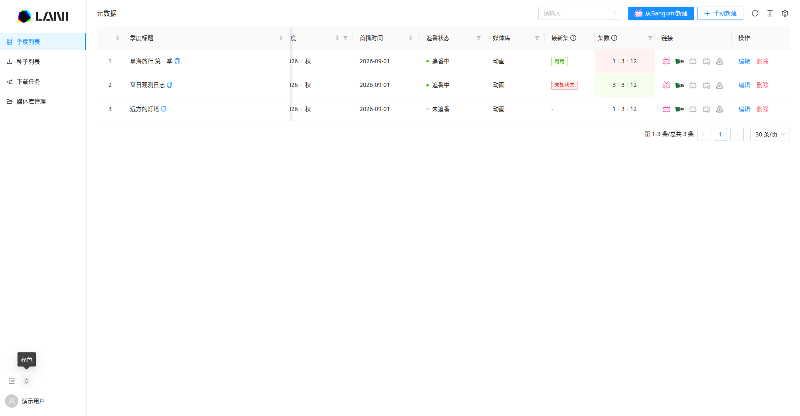
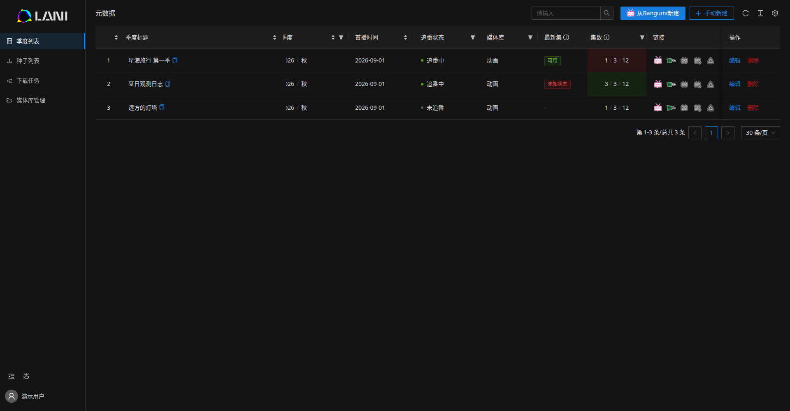

# 主题

侧栏主题按钮按「亮 → 暗 → 系统 → 亮」循环，默认跟随系统。桌面端按钮位于独立折叠按钮右侧，侧栏折叠后隐藏主题按钮；移动端以纯图标位于侧栏底部分割线下方、单行用户信息上方。移动端不显示主题 Tooltip，桌面端 Tooltip 只显示当前状态「亮色」「暗色」「遵循系统」。太阳、月亮使用 AntD 图标，系统图标由两者的半边和斜杠组合。

偏好复用 `store2`，以 JSON 字符串保存到 localStorage 的 `lani:theme`，只在当前浏览器保存。系统模式监听 `prefers-color-scheme`；同源标签页通过 `storage` 事件同步。无效或不可读的设置回退到系统模式，无法写入存储时仍可在当前页面切换。

首屏 head 脚本在渲染前设置 `html[data-theme]` 和 `color-scheme`。运行时只更新主题属性和 Context，不重建页面、表单或弹窗。

暗色侧栏与页面主体使用相同背景色；选中菜单使用半透明主题蓝背景和右侧实色蓝色竖条，桌面及移动端保持一致。

## 样式维护

- 当前使用 antd 4 / Umi 3。`config/theme-loader.cjs` 包装 Umi 的 Less loader，独立编译组件库的亮色与官方暗色主题，覆盖 antd 和 Pro 组件。暗色 CSS 通过 `:where(html[data-theme="dark"])` 限定，保持原有选择器优先级，并覆盖挂在 body 下的弹窗。动画名称独立，避免覆盖亮色动画。
- 两套样式随原有 chunk 一起加载。代价是 CSS 体积与 Less 编译时间增加；切换时不需要再下载样式。
- 业务样式使用 `src/styles/theme-colors.less` 中的 `--lani-*` 语义变量，值来自 antd Less 主题。新增颜色时扩展此处，避免重新写死色值。
- 种子标签在 `src/theme/tagColors.ts` 中保留名称对应的色相，按主题调整亮度和饱和度。Logo 使用内联 SVG 的 `currentColor`，品牌图形保留原色。
- 修改主题构建逻辑后，若开发模式 MFSU 仍使用旧的依赖样式，停止开发服务并移走 `src/.umi/.cache` 后重新启动。

## 验证

在 `apps/admin` 运行 `npm run test:theme`，覆盖模式循环、存储失败、首屏初始化、标签对比度、antd/Pro 的真实 Less 配色、根节点与动画规则及编译失败传播。测试使用项目已有依赖和 Node 20+ 自带的测试运行器。

浏览器回归应覆盖桌面展开/折叠、手机侧栏、系统主题实时变化、刷新后的偏好、跨标签页同步，以及切换时保留未保存输入、滚动位置和弹窗。截图使用演示数据：

| 桌面亮色 | 桌面暗色 |
| --- | --- |
|  |  |

[折叠侧栏](screenshots/theme-desktop-collapsed.png) · [移动端](screenshots/theme-mobile-dark.png) · [下载弹窗](screenshots/theme-modal-dark.png) · [种子选择](screenshots/theme-torrent-selection-dark.png)
